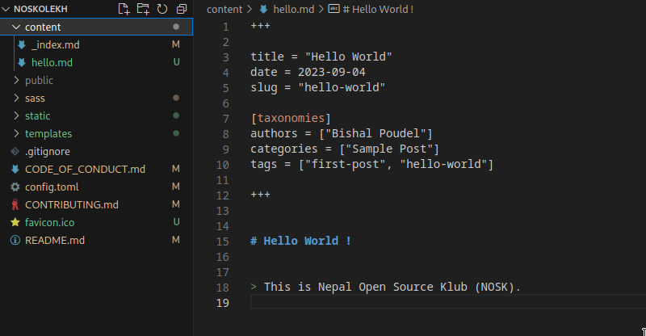

# NOSKOLEKH
It is a blogging site developed for the individual who want to express their thoughts on the internet through Nepal Open Source Klub(NOSK). As being Open Source club we promote and motivate to write on technology and development with freedom.

# Contribution
>All the contributors must need to follow the [Code of Conduct](CODE_OF_CONDUCT.md).

## > As a Developer
Anyone with interest can contribute on the site to improve it. This site is developed using [Zola](https://www.getzola.org/) - A static site engine.

Simple knowledge about HTML, CSS, Markdown, Git, GitHub and Zola with problem solving mind are sufficient to contribute as a developer

## > As a Author
A person having creativity and interest with basic knowledge about Git, GitHub and Markdown can be an author of the blog or articles. To submit your blog you need to: 

1. Create GitHub account
2. Fork the repository to your account
3. Clone forked repo 
4. Inside content directory, create your blog name .md file and write content in the format

5. If you need to upload an image then create a direcrory inside content and upload there
6. Add, Commit and push the update to your remote repo
7. Send Pull Request, and wait for approval

> Congratulations!! \
 You contributed to an open-source project.
