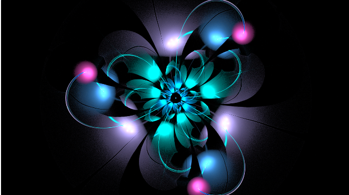

+++

title = "Exploring the World of Computer Graphics""
date = 2023-Oct-03
slug = "Computer-Graphics"

[taxonomies] 
authors = ["Piyush"]
categories = ["Post"] 
tags = ["first-post", "Computer-Graphics"] 

+++

# Introduction to Computer Graphics: Exploring the Digital Visual World

Computer graphics is a fascinating field that has revolutionized the way we perceive and interact with digital visual content. From movies and video games to virtual reality and computer-aided design, computer graphics plays a central role in creating immersive and realistic experiences. In this article, we will explore the fundamentals of computer graphics, including its history, underlying technologies, and applications

## Understanding Computer Graphics 
1. ### What is Computer Graphics? 
Computer graphics is the field of creating, manipulating, and rendering visual content using computers. It involves the use of algorithms, software, and hardware to generate and display images, animations, and interactive experiences. By simulating the behavior of light, surfaces, and objects, computer graphics aims to create realistic and immersive visual representations.

2. ### Evolution of Computer Graphics 
The evolution of computer graphics can be traced back to the 1960s when Ivan Sutherland developed the first computer graphics system called Sketchpad. This system allowed users to interact with the computer using a light pen and draw objects directly on the screen. Since then, computer graphics has progressed rapidly, driven by advancements in hardware and software technologies.

In the 1970s, researchers developed techniques for rendering three-dimensional (3D) objects and scenes using wireframe models. The emergence of raster graphics in the 1980s enabled the representation of images as a grid of pixels, leading to the development of more realistic computer-generated images.

The 1990s witnessed significant advancements in computer graphics with the introduction of texture mapping, shading models, and more sophisticated rendering algorithms. This decade also marked the rise of the gaming industry, which heavily relied on computer graphics for creating immersive virtual worlds.

3. ### Importance of Computer Graphics 
Computer graphics plays a crucial role in various fields and industries. In the entertainment industry, computer graphics is used to create stunning visual effects in movies, television shows, and video games. It allows filmmakers and game developers to bring imaginary worlds to life and captivate audiences with realistic animations and special effects.

In the field of computer-aided design (CAD), computer graphics enables engineers and designers to create and visualize complex 3D models of products and structures. This aids in the design process, allowing for better accuracy, efficiency, and innovation.

Virtual reality (VR) and augmented reality (AR) heavily rely on computer graphics to create immersive and interactive experiences. By rendering virtual environments and overlaying digital content onto the real world, computer graphics enables users to explore new dimensions and interact with virtual objects.

Scientific visualization utilizes computer graphics to represent complex data sets in a visual and intuitive manner. It helps researchers and scientists analyze and understand complex phenomena by transforming data into meaningful visual representations.

## Image Display and Rendering 

1. ### Image Display Techniques 

Image display techniques are fundamental to computer graphics as they determine how images are rendered and presented to the viewer. One common technique is rasterization, which involves converting 3D objects and scenes into a 2D image composed of pixels. This process involves projecting 3D coordinates onto a 2D plane and assigning colors or textures to the resulting pixels.

Another technique is ray tracing, which simulates the behavior of light rays in a scene to calculate the color and intensity of each pixel. Ray tracing produces more realistic and accurate images by considering factors such as reflections, refractions, and shadows.

2. ### Real-Time Rendering 

Real-time rendering is a crucial aspect of computer graphics, especially in interactive applications such as video games and virtual reality. Real-time rendering aims to generate and display images at a sufficiently high frame rate to create the illusion of smooth motion. This requires efficient algorithms and hardware optimizations to handle complex scenes and lighting calculations in real-time.

Graphics Processing Units (GPUs) play a vital role in real-time rendering as they are specifically designed to handle the parallel processing requirements of computer graphics. GPUs excel at performing calculations for rendering multiple objects and applying complex shaders and effects.

3. ### Ray Tracing 

Ray tracing is a rendering technique that simulates the behavior of light rays in a scene to generate realistic images. It traces the path of light rays from the camera through each pixel, interacting with objects in the scene to calculate their color and intensity. Ray tracing accounts for effects such as reflections, refractions, and shadows, resulting in highly realistic images.

Ray tracing has traditionally been computationally expensive and time-consuming, making it impractical for real-time applications. However, advancements in hardware, such as the introduction of dedicated ray tracing hardware in GPUs, have made real-time ray tracing feasible.

## Processors and Programs 

1. ### Graphics Processing Units (GPUs) 

Graphics Processing Units (GPUs) are specialized processors designed for handling the complex calculations required by computer graphics. GPUs excel at parallel processing, allowing them to simultaneously perform calculations for multiple pixels or objects in a scene. This parallelism is crucial for real-time rendering and interactive applications.

Modern GPUs have evolved significantly, with dedicated hardware for tasks such as vertex processing, geometry processing, and pixel shading. They also support advanced features like programmable shaders, which allow developers to customize the rendering pipeline and create complex visual effects.

2. ### Programming Languages for Computer Graphics 

Several programming languages are commonly used in computer graphics development. One widely used language is C++, which offers low-level control and performance optimization. C++ is often used in graphics libraries and game engines to develop real-time rendering applications.

Other popular languages include OpenGL and DirectX, which are graphics APIs (Application Programming Interfaces) that provide a high-level interface for interacting with graphics hardware. These APIs abstract the complexities of graphics programming and provide a standardized way to access GPU functionality.

## Applications of Computer Graphics 

1. ### Entertainment Industry 

The entertainment industry heavily relies on computer graphics for creating visually stunning movies, television shows, and video games. Computer-generated imagery (CGI) enables filmmakers and game developers to create realistic characters, environments, and special effects that would be otherwise impossible or impractical to achieve.

2. ### Computer-Aided Design (CAD) 

Computer graphics has revolutionized the field of computer-aided design (CAD), allowing engineers and designers to create and visualize complex 3D models of products and structures. CAD software enables efficient design iterations, accurate measurements, and virtual simulations, leading to improved productivity and innovation in various industries.

3. ### Virtual Reality (VR) and Augmented Reality (AR) 

Virtual reality (VR) and augmented reality (AR) rely on computer graphics to create immersive and interactive experiences. VR provides users with a fully simulated environment, while AR overlays digital content onto the real world. Both technologies leverage computer graphics to render virtual objects, simulate realistic lighting and shading, and provide a seamless user experience.

4. ### Scientific Visualization 

Scientific visualization utilizes computer graphics techniques to represent complex data sets in a visual and intuitive manner. It helps researchers and scientists analyze and understand complex phenomena by transforming data into meaningful visual representations. Scientific visualization is widely used in fields such as medicine, geology, astrophysics, and climate science.

## Conclusion 

Computer graphics is a vast and ever-evolving field that has transformed the way we create, visualize, and interact with digital visual content. From entertainment and design to virtual reality and scientific research, computer graphics plays a central role in various industries. With advancements in hardware and software technologies, the future of computer graphics holds immense potential for creating even more realistic and immersive visual experiences.

In this article, we have explored the fundamentals of computer graphics, including its history, image display and rendering techniques, processors and programs, and applications. By understanding the underlying principles and technologies of computer graphics, we can appreciate the incredible impact it has on our digital visual world.

> Blog by Piyush 
